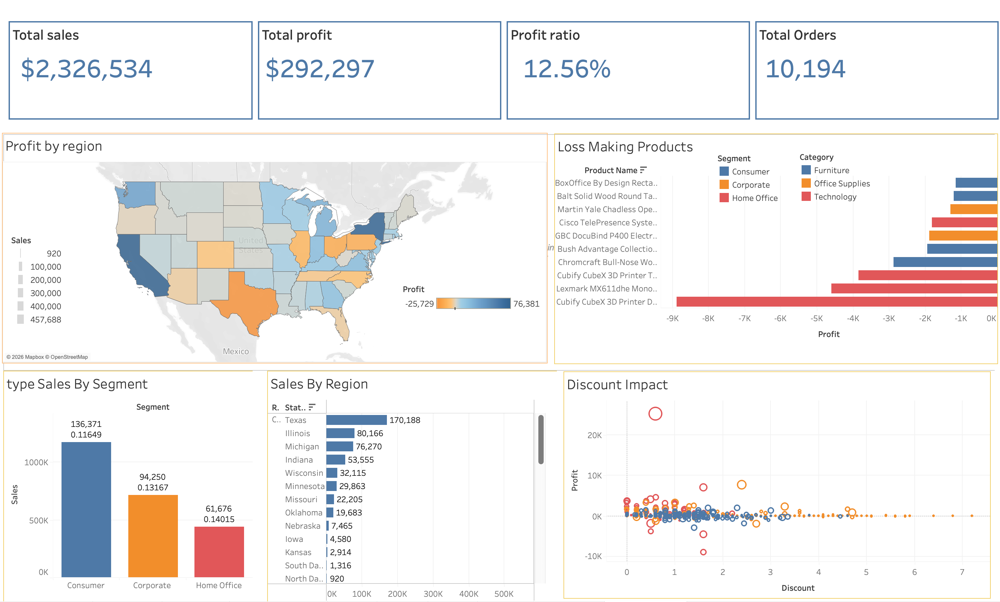

# Superstore USA Region Dashboard

This repository contains the dashboard visualizing the performance of the Superstore in the USA region. The dashboard is designed to provide actionable insights into sales, profit, product performance, and the impact of discounts across different segments and states.

## 📊 Dashboard Overview

The dashboard presents key performance indicators (KPIs) and several detailed visualizations to help understand the business's profitability and sales distribution. 

### Key Performance Indicators (KPIs)
At the top of the dashboard, the following high-level metrics are displayed:
- **Total Sales:** $2,326,534
- **Total Profit:** $292,297
- **Profit Ratio:** 12.56%
- **Total Orders:** 10,194

---

## 📈 Visualizations & Insights

### 1. Profit by Region (Map)
- **Description:** A geographical map of the United States colored by profit, with states generating negative profit shown in orange and highly profitable states in dark blue.
- **Insights:**
  - States like **Texas** show significant losses (indicated by the deep orange color), despite having high sales. 
  - Coastal states like **California** and **New York** are highly profitable (dark blue).
  - This highlights the need to investigate pricing or operational costs in the Central region, specifically Texas.

### 2. Loss Making Products
- **Description:** A horizontal bar chart identifying the products with the highest negative profit. It is color-coded by category (Technology in red, Furniture in blue, Office Supplies in orange).
- **Insights:**
  - The biggest loss-maker is the **Cubify CubeX 3D Printer** (Technology category), which heavily dragged down profits.
  - Other significant loss-making items include Lexmark printers and certain furniture items (like Chromcraft tables).
  - The business should consider reviewing the pricing strategy, shipping costs, or discontinuing these specific underperforming products.

### 3. Sales By Segment
- **Description:** A vertical bar chart comparing total sales across three segments: Consumer, Corporate, and Home Office.
- **Insights:**
  - The **Consumer** segment is the largest driver of sales, exceeding $1.16M.
  - **Corporate** and **Home Office** segments follow respectively. 
  - Profitability ratios are also indicated, showing that while Consumer has the highest volume, all segments maintain relatively similar profit margins (around 11% to 14%).

### 4. Sales By Region (State-level breakdown)
- **Description:** A horizontal bar chart listing the top states by total sales, grouped by region.
- **Insights:**
  - **Texas** leads the Central region in sales ($170,188) but, as seen in the map, operates at a major loss.
  - Illinois and Michigan follow in sales volume within that specific view.
  - High sales volume does not consistently correlate with high profitability.

### 5. Discount Impact
- **Description:** A scatter plot illustrating the relationship between the discount applied and the resulting profit. 
- **Insights:**
  - There is a clear trend indicating that **higher discounts lead to negative profits**.
  - Many of the deeply discounted orders fall below the break-even line (profit < 0).
  - The data suggests that current discounting strategies are actively harming the bottom line and need to be optimized or restricted, especially for high-value Technology and Furniture items.

---

## 🚀 Conclusion

The dashboard reveals that while the Superstore has strong overall sales ($2.3M) and a healthy overall profit ratio (~12.5%), there are critical areas for improvement. Specifically, the heavy losses in Texas, the negative impact of high discount rates, and specific loss-making products (like 3D printers) require immediate strategic review to optimize profitability.
